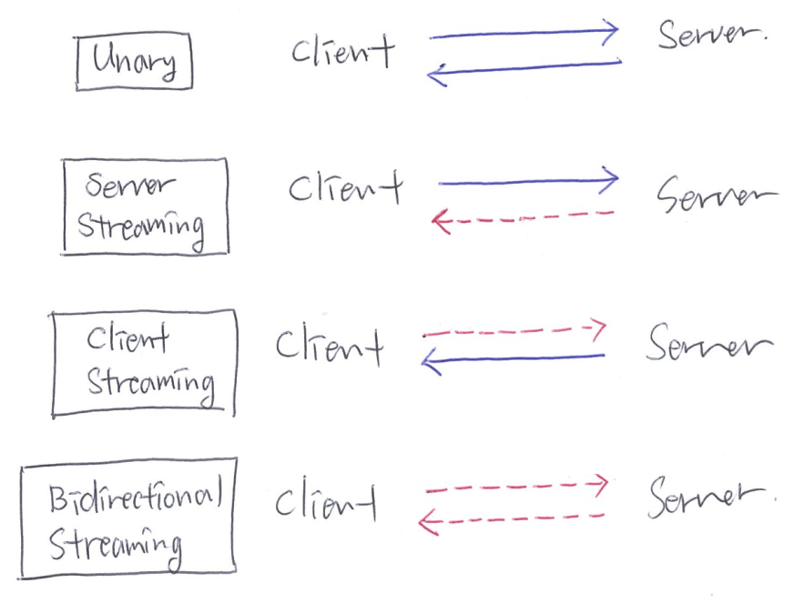

# hello_grpc

A high-performance, open source universal RPC framework

gRPC lets you define four kinds of service method

https://grpc.io/docs/guides/concepts/

|Method  | Request  | Response  |  Example
|:---|:---|:---|:---|
| `Unary`| Single |  Single | Greeting|
| `Server-side streaming` | Single  | Stream  | File downloading|
| `Client-side streaming` | Stream  | Single  | File uploading|
| `Bidirectional streaming` | Stream | Stream  | Shouting each other|

#### 1. Simple RPC

`Unary RPC` When greeting

- Client: Single request
- Server: Single response

[Example](./hello)

#### 2. server-side streaming RPC

- Client: Single request
- Server: Stream response

`Server streaming` When downloading data

[Example](./download)

#### 3. client-side streaming RPC

`Client streaming` When uploading data

- Client: Stream request
- Server: Single response

[Example](./upload)

#### 4. bidirectional streaming RPC  

`Bidirectional streaming` When shouting each other

- Client: Stream request
- Server: Stream request

https://github.com/protocolbuffers/protobuf/releases
