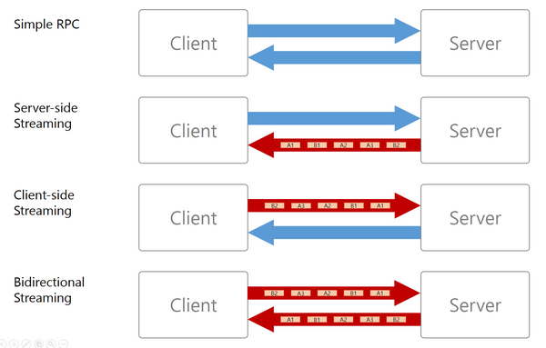

# hello_grpc

gRPC's four kinds of service method

https://grpc.io/docs/guides/concepts/

|Method  | Request  | Response  |  Example |
|:---|:---|:---|:---|
| `Unary`| Single |  Single | Greeting|
| `Server-side streaming` | Single  | Stream  | File downloading|
| `Client-side streaming` | Stream  | Single  | File uploading|
| `Bidirectional streaming` | Stream | Stream  | Shouting each other|

#### 1. Unary RPC

- Client: Single request
- Server: Single response

[ex - Greeting](greeting)

#### 2. Server-side streaming RPC

- Client: Single request
- Server: Stream response

[ex - Downloading data](./download)

#### 3. Client-side streaming RPC

- Client: Stream request
- Server: Single response

[ex - Uploading file](./upload)

#### 4. Bidirectional streaming RPC  

- Client: Stream request
- Server: Stream request

[ex - Shouting each other](./referee)

## Prerequisites

1) [Download Protocol Buffer](https://github.com/protocolbuffers/protobuf/releases)
2) Install `protoc-gen-go` that is a plugin for the Google protocol buffer compiler to generate Go code.

    go get -u github.com/golang/protobuf/protoc-gen-go
    
    